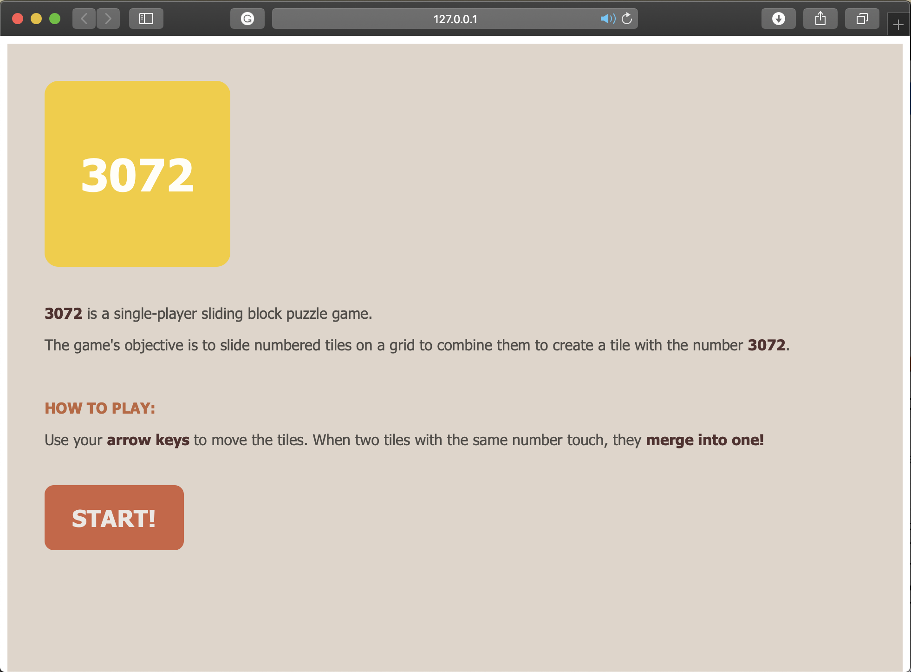

# First Project: 3072 Game
3072 is a single-player sliding block puzzle game. The game's objective is to slide numbered tiles on a grid to combine them to create a tile with the number 3072.
#

## Game Instructions
Use your arrow keys to move the tiles. When two tiles with the same number touch, they merge into one!
#

## Game Design Structure

### Project Wireframes
#### Landing Page Wireframe


#### Game Page Wireframe
While playing:


When the game ends (Game Over alert):


### Programming Languages
The project has been built using the following:
- Hypertext Markup Language (HTML) 
- Cascading Style Sheets (CSS)
- JavaScript

### HTML & CSS

The game designed by using HTML and CSS. The game design structured by using: Headers, paragraphs, and tons of divs. Then, these elements styled by CSS, with the help of grid and flex displays. 

And here we are!

#### Landing Page:


#### Game Page:


### JavaScript

The game is working by taking the multiple of 3, and multiply each by 2 until reaching the desired winning value which is 3072, as shown in the table below:
| Value | Value x 2 |
| --- | --- |
| 3 | 6  |
| 6 | 12  |
| 12 | 24  |
| 24 | 48  |
| 48 | 96  |
| 96 | 192 |
| 192 | 384 |
| 384 | 768 |
| 768 | 1536 |
| 1536 | 3072 | 

The user has to move these numbers by using the arrow keys of their keyboards, in order to make the similar numbers joined and multiplied by 2, and make one of them empty after joining its twin.

In order to achieve this, we have to have functions that controls this movements within our grid by using the arrow keys. So, I have created the following functions:
```
goUp()
goDown()
goLeft()
goRight()
```
Each of the above functions is then connected with the respectful keyCodes of each of the arrow keys of your keyboard, so everything will work together properly. 

| KeyCode | Keyboard Button |
| --- | --- |
| 37 | ArroWRight |
| 38 | ArrowUp  |
| 39 | ArrowLeft  |
| 40 | ArrowDown  |


- goUp() and goDown() functions have the same principles. Both of them designed to check the rows, all the rows above in case of goUp(), and all the rows below in case of goDown.
- goRight() and goLeft() functions also have the same principles. Both of them designed to check the columns, all the columns in the right in case of goRight(), and all the columns in the left in case of goLeft.
- After checking, merging tiles comes! The functions will merge the two twin tiles depending on the pressed arrow key and empties the merged tile.
- The process will (congratulations) continue unless you win or there are no close twins to merge (Game ver my friend). 


#

### Difficulties:
I faced some difficulties in showing the game over alert. 
#

### Future Work:
In order to enhance this game, and make it more flexible as well as challenging, I would like to do the following:
- Make the user choose the size of the game grid, instead of a 4x4 grid. 
- Make the game available with all off numbers multiples, not only 2 and 3 multiples.
- Apply the game scores.
#


